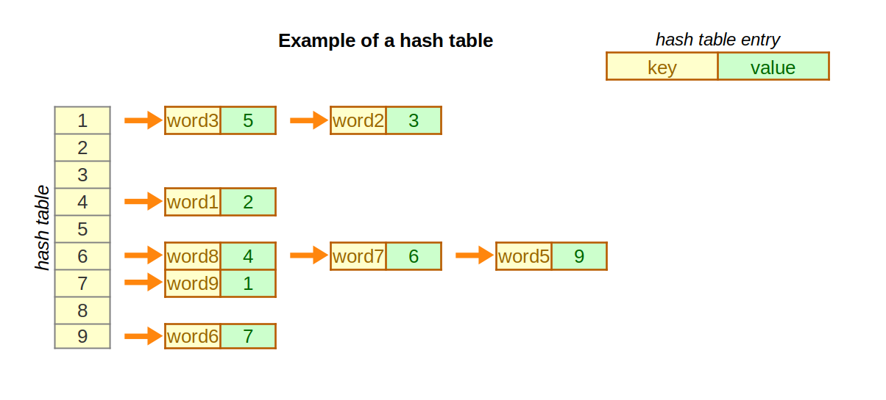
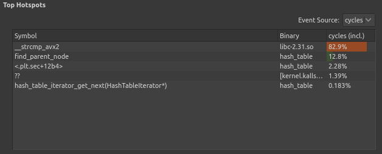
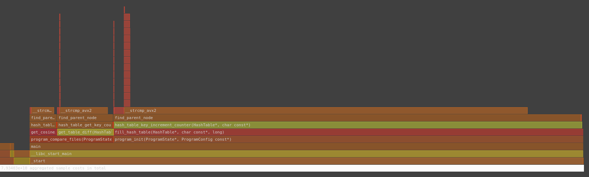
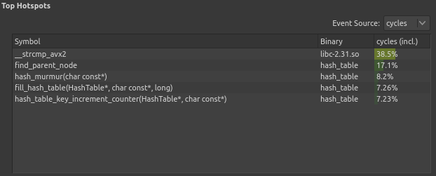
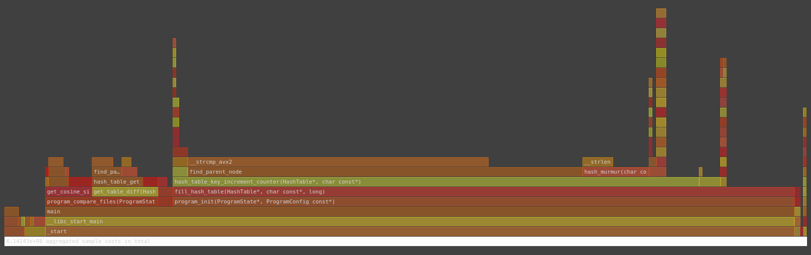
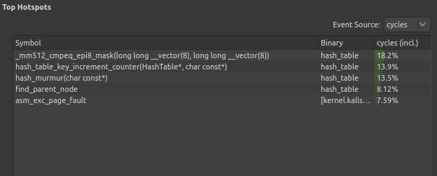
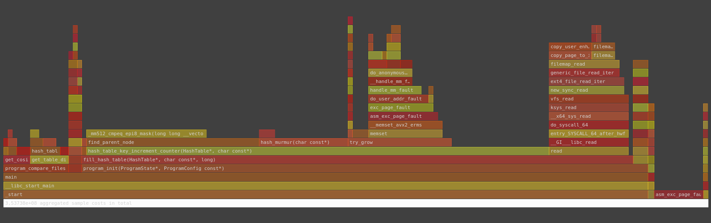

# Hash Table Optimizations

## Introduction

This research focuses on the optimizations of the following algorithm:
1. Load words from text files
2. Calculate cosine similarity of two texts interpreted as sets of words
3. Count the total number of distinct words unique to each text

Cosine similarity between texts is calculated using the formula:

$$
cos(\varphi) = \frac{\sum\limits_{w \in A} \left(f_A(w) \cdot f_B(w)\right)}
                        {\sqrt{\sum\limits_{w \in A} f_A^2(w)} \cdot
                         \sqrt{\sum\limits_{w \in B} f_B^2(w)}}
$$

Where:
- $A$ - set of words in the first text
- $B$ - set of words in the second text
- $f_A(w)$ - frequency of word $w$ in the first text
- $f_B(w)$ - frequency of word $w$ in the second text

The algorithm was used to compare the following two texts:
[novel "War and Peace" by L. Tolstoy](assets/war_and_peace.txt) and
[collection of works by A. Pushkin (volumes 1-6)](assets/pushkin_vol1-6.txt).

Hash table data structure was utilized in the created program. The program
performance was highly dependent on the efficient implementation of hash table.

### **Hash table**

A *hash table* is a data structure, used to store arbitrary objects, called
*keys*.  According to D. Knuth (The Art of Programming, vol. 3 ed.3, section 6.4),
*hashing* is a method of computing some numeric value based on a given key.
The resulting number is called a *hash* and the function performing the
mapping between the set of keys and a set of hashes is called a *hash function*.

The calculated hash is used as a hash table index to store the keys.
Because the hash is not unique to a given key, *collisions* arise, when
different keys are mapped to the same hash. To store both keys in a hash
table, the collision must be resolved. One way to resolve collisions is by
*chaining* the keys with the same hash. Keys corresponding to the same hash form
a *bucket*.

It is often required to store additional information alongside the key in
a hash table. In this *key-value pair* only the key is used to calculate the
hash function, while the value can be modified independently. The keys in
a hash table cannot be modified as this might change their hash.

Figure 1 demonstrates an example of a hash table containing eight entries
(chaining is shown with orange arrows).

|  |
| --- |
| *Figure 1. Example of a hash table.* |

Eight entries are distributed across nine buckets. Two chains are formed due to
collisions: ('word3' -> 'word2' and 'word8' -> 'word7' -> 'word5'). No entries
are stored in buckets 2, 3, 5, and 8, because no keys correspond to these hashes.

## Materials and methods

### **Hash table algorithm**

The data structure described above was implemented as follows (full
implementation can be found [here
](https://github.com/MeerkatBoss/hash_table/blob/baseline/src/hash_table/hash_table.cpp)):

- A total of two hash tables were created: one for each of the texts.
- Number of buckets in table was a small prime number (19 in this case)
- Chaining was implemented using linked lists
- Hash table used [MurmurHash](https://github.com/aappleby/smhasher/blob/master/src/MurmurHash2.cpp)
    as a hash function

### **Testing methods**

The program described above accesses the hash table often. Before inserting a
word into hash table, the program should first check whether this word is
already stored there. Additionally, the calculation of cosine similarity and counting
of distinct words required querying the frequency of each word in the first table
from the second. Consequently, we can expect that program execution time will be
mostly affected by the efficiency of search algorithm.

The size of hash table was deliberately chosen to be too small for the task thus
demonstrating the importance of choosing the hash table size appropriately.

Program performance was recorded by executing it as a child process and
calling `getrusage()` function, which allows to obtain verbose information about
the process, including its execution time.

Implementation of the tests described above can be found [here
](tests/test_cases/benchmark.cpp).

Program was executed 5 times and the average of elapsed times was taken to
account for OS-specific measurement errors.  This test was repeated 10 times,
the mean and standard deviation of results were calculated.

More detailed information about program performance (namely the most
performance-affecting functions) was obtained using the Unix `perf` tool. The
graphical representation of collected data was created using the `hotspot`
application.

## Results

### **Tests for the baseline version**

The results of a baseline version (described above) were as follows:

| Program version | Average time (ms) | Absolute performance gain (times) | Relative performance gain (times) |
| --- | --- | --- | --- |
| baseline | 19300 $\pm$ 400            | 1            | N/A           |

**Note:** *Baseline performance gain is taken as 1 for convenience*

Figure 2 shows the most time consuming functions with their respective execution
times shown as percentages of total elapsed time. Figure 3 shows the program
execution flame graph.

| |
| --- |
| *Figure 2. Baseline hotspot functions.* |

|  |
| --- |
| *Figure 3. Baseline flame graph* |

Flame graph shows relationships between function and their relative execution
times. The called functions are stacked on top of their callers.
The length of bars represents the percentage of caller function execution
time spent on executing the called function.

The `__strcmp_avx2` function is an alternative, more efficient implementation
of `strcmp` function, used to compare two strings. The compiler attempts to
optimize the program by replacing calls to `strcmp` with calls to
`__strcmp_avx2`.

`find_parent_node` is a function used by hash table uses to find the key in
bucket. This function compares each key in bucket with the key under search and
returns the node preceding the first match.

83.7% of program execution time is spent on calls to `__strcmp_avx2` function,
which indicates that `find_parent_node` needs to compare the given key with
many keys stored in the bucket. This means that the bucket sizes are very large,
because the size of hash table is much smaller than the number of keys stored
in it.

### **Tests for the second version** 

The tests on baseline version indicate that the hash table size must be increased.
In the second version of the program, [the table size was increased from 19 to
7019](https://github.com/MeerkatBoss/hash_table/blob/4d5df30f9cbfeffc17114d38aa7871a4e63fae8a/src/table_utils/config.h#L19);

The results of testing the optimized version were the following:
| Program version | Average time (ms) | Absolute performance gain (times) | Relative performance gain (times) |
| --- | --- | --- | --- |
| baseline | 19300 $\pm$ 400            | 1            | N/A           |
| table size optimization | 130 $\pm$ 3 | 148 $\pm$ 5  | 148 $\pm$ 5   |  

| |
| --- |
| *Figure 4. Second version hotspot functions.* |

|  |
| --- |
| *Figure 5. Second version flame graph* |

Only 42.7% of program execution time is spent on calls to `strcmp` now, which
allows to perform optimizations of this function.

From now on, absolute performance gain will be calculated relative to the second
version, as the baseline version was too inefficient.

### **Tests for the third version**

The second version of the program was optimized by replacing calls to `strcmp`
with Intel SIMD intrinsics. To use SIMD efficiently, the input file format was
changed to the following:

The key words "MUST", "MUST NOT", "REQUIRED", "SHALL", "SHALL
    NOT", "SHOULD", "SHOULD NOT", "RECOMMENDED",  "MAY", and
    "OPTIONAL" in this document are to be interpreted as described in
    [RFC 2119](https://www.rfc-editor.org/rfc/rfc2119).

- The file MUST NOT have any file header, containing additional information
- Each word MUST occupy exactly 64 consecutive bytes
- Shorter words MUST be padded with zero bytes on the right
- The beginning of each word MUST be aligned to 64 bytes
- Words longer than 64 bytes MUST NOT be present in file

The last requirement was easily satisfied, as neither of texts contained words
longer than 64 bytes in UTF-8 encoding. The other requirements were satisfied by
converting both text files to specified format using
[this Python script](https://github.com/MeerkatBoss/hash_table/blob/strcmp_intrin_opt/convert.py).

The test results for the
[third version](https://github.com/MeerkatBoss/hash_table/tree/strcmp_intrin_opt)
were the following:

| Program version | Average time (ms) | Absolute performance gain (times) | Relative performance gain (times) |
| --- | --- | --- | --- |
| table size optimization | 130 $\pm$ 3 | 1                  | N/A           |  
| SIMD optimization       | 78 $\pm$ 5  | 1.7 $\pm$ 0.1      | 1.7 $\pm$ 0.1 |

| |
| --- |
| *Figure 6. Third version hotspot functions.* |

|  |
| --- |
| *Figure 7. Third version flame graph* |

The performance nearly doubled as the comparison of keys is now performed with a
single CPU instruction.

`_mm512_cmpeq_epi8_mask` is a name of Intel SIMD intrinsic, which is compiled
into a single instruction from 'AVX512' instruction set. This hotspot cannot
be optimized further.

`hash_table_increment_counter` is a function used to update word frequency. It
performs copying of keys to hash table. This is a relatively time-consuming
operation that cannot be optimized.

### **Tests for the fourth and the fifth versions**

After `__strcmp_avx2` was optimized, the only remaining function to optimize is
`hash_murmur`. In the [fourth version
](https://github.com/MeerkatBoss/hash_table/blob/hash_asm_opt/src/hash_table/hashes/asm_hash.asm)
this function was rewritten in pure assembly language (NASM dialect), and in the
[fifth](https://github.com/MeerkatBoss/hash_table/blob/568c61a3ae637403896ce46b457acafc0ae2ab75/src/hash_table/hash_table.cpp#L38)
using [GCC inline assembly language
](https://gcc.gnu.org/onlinedocs/gcc/Using-Assembly-Language-with-C.html),
to allow function inlining.

The test results for these versions are as follows:

| Program version | Average time (ms) | Absolute performance gain (times) | Relative performance gain (times) |
| --- | --- | --- | --- |
| table size optimization | 130 $\pm$ 3 | 1                  | N/A           |  
| SIMD optimization       | 78 $\pm$ 5  | 1.7 $\pm$ 0.1      | 1.7 $\pm$ 0.1 |
| asm optimization        | 81 $\pm$ 6  | 1.6 $\pm$ 0.1      | 0.9 $\pm$ 0.1 | 
| inline asm optimization | 72 $\pm$ 6  | 1.8 $\pm$ 0.2      | 1.1 $\pm$ 0.1 |

The initial assembly optimization slightly slowed the program down, but with the
help of inline assembly the program became faster again.

## Discussion

### **The most effective optimizations**

Among all the optimization steps taken in this research, the first one had the
greatest effect on program performance. Hash table size of 19 was clearly
insufficient for the volumes of text loaded into it. Increasing the hash size
made it possible to apply other optimizations.

Usage of SIMD required changing the input format, but it nearly doubled the
program performance.

### **Assembly optimization**

Assembly-based optimizations can be applied only in highly specific cases, in
which a function cannot be efficiently implemented in pure C or the compiler
fails to optimize it. The MurmurHash algorithm was designed to be efficiently
implemented in C. This makes it hard to optimize using assembly language.

However, the inline assembly language allows to calculate hash without additional
function call, which saves time on indirect jumps, happening when the called
function finishes its execution. This also increases code locality, as the
code used for calculating the hash, and the code using said hash are located
closer to each other.

## Conclusions

When optimizing the performance of hash table, the first logical step is to
increase its size. This is the most performance-affecting parameter of a hash
table.

Usage of SIMD restricts the format of input data and makes program non-portable,
but provides a significant performance gain and can be used in cases where
requirements for input format can be easily satisfied and program portability
is not required. Additionally, some of the most used algorithms are implemented
in SIMD. For example, hash table might use [Cyclic Redundancy Checks (CRC)
](https://datatracker.ietf.org/doc/html/rfc3385) as a hash function. This
algorithm is implemented with instructions from SSE4.2 instruction set, thus
allowing to calculate the hash function much faster.

Assembly-based optimizations cannot be applied universally. However, if the
performance-affecting function can be optimized using assembly language, the
usage of inline assembly language can significantly shorten the program
execution time.
