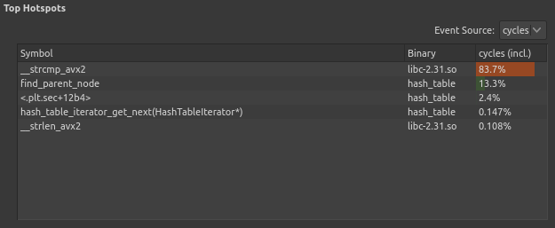
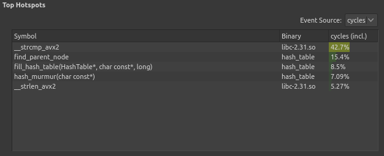

# Hash Table

## Introduction

This research focuses on the optimizations of the following algorithm:
1. Load words from text files
2. Calculate cosine similarity of two texts
3. Count total number of distinct words unique to each text

Cosine similarity between texts is calculated using the formula:

$$
cos(\varphi) = \frac{\sum\limits_{w \in A} \left(f_A(w) \cdot f_B(w)\right)}
                        {\sqrt{\sum\limits_{w \in A} f_A^2(w)} \cdot
                         \sqrt{\sum\limits_{w \in B} f_B^2(w)}}
$$

Where:
- $A$ - set of words in first text
- $B$ - set of words in second text
- $f_A(w)$ - frequency of word $w$ in first text
- $f_B(w)$ - frequency of word $w$ in second text

Program compared the following two texts:
[novel "War and Peace" by L. Tolstoy](assets/war_and_peace.txt) and
[collection of works by A. Pushkin (volumes 1-6)](assets/pushkin_vol1-6.txt).

The program was implemented using the hash table data structure. The program
performance relied heavily on the efficient implementation of hash table.

### **Hash table**

According to D. Knuth (The Art of Programming, vol. 3 ed.3, section 6.4),
*hashing* is a method of computing some numeric value based on a given key.
The result of hashing is called a *hash* and the function performing the
mapping between the set of keys and a set of hashes is called a *hash function*.

The calculated hash is used to store the keys in a *hash table*. Because the
hash is not unique to a given key, *collisions* arise, when different keys
are mapped to the same hash. To store both keys in a hash table, the collision
must be resolved. One way to resolve collisions is by *chaining* the keys with
the same hash. Keys corresponding to the same hash form a *bucket*.

It is often required to store additional information alongside the key in
a hash table. In this *key-value pair* only the key is used to calculate the
hash function, while the value can be modified independently. The keys in
a hash table cannot be modified as this might change their hash.

Figure 1 demonstrates an example of a hash table containing 8 entries (chaining
is represented with orange arrows).

|  |
| --- |
| *Figure 1. Example of a hash table.* |

8 entries are distributed across 9 buckets. Two chains are formed due to
collisions: ('word3' -> 'word2' and 'word8' -> 'word7' -> 'word5'). No entries
are stored in buckets 2, 3, 5, and 8, because no keys correspond to these hashes.

## Materials and methods

### **Hash table algorithm**

The tested data structure was implemented as follows (full implementation can
be found [here](https://github.com/MeerkatBoss/hash_table/blob/baseline/src/hash_table/hash_table.cpp)):

- Hash table used closed addressing (open hashing)
- Number of buckets in table was a prime number (19)
- Chaining was implemented using linked lists
- Hash table used [MurmurHash](https://github.com/aappleby/smhasher/blob/master/src/MurmurHash2.cpp)
    hash function

### **Testing methods**

The program described above performs accesses the hash table often. Before
inserting each word in hash table, the program must first check whether or not
this word is already stored. Additionally, the calculation of cosine similarity
and counting of distinct words required querying each word from one hash table
in another. Based on this information we can expect that program execution time
will be mostly affected by the efficiency of search algorithm.

Program performance was recorded by executing it as a child process and
calling `getrusage()` function, which allows to obtain verbose information about
process execution, including its execution time.

The testing function implementation can be found
[here](tests/test_cases/benchmark.cpp).

Program was executed 5 times and the average of execution times was taken.
This test was repeated 10 times, the average and standard deviation of results
were calculated.

More detailed information about program performance (namely the most
performance-affecting functions) was obtained using the Unix `perf` tool. The
graphical representation of collected data was created using the `hotspot`
application.

## Results

### **Baseline tests**

The results of a baseline version (described above) were as follows:

| Program version | Average time (ms) | Absolute performance gain (times) | Relative performance gain (times) |
| --- | --- | --- | --- |
| baseline | 19300 $\pm$ 400            | 1            | N/A           |

**Note:** *Baseline performance gain is taken as 1 for convenience*

Figure 2 shows the percentages of program execution time spent on execution of
the most time consuming functions. Figure 3 shows the program execution
flame graph.

| |
| --- |
| *Figure 2. Baseline hotspot functions.* |

|  |
| --- |
| *Figure 3. Baseline flame graph* |

Flame graph represents the relationships between function and their relative
execution times. The called functions are stacked on top of their callers.
The length of bars represents the percentage of caller function execution
time spent on executing the called function.

The `__strcmp_avx2` function is an alternative, more efficient implementation
of `strcmp` function, used to compare two strings. The compiler attempts to
optimize the program by replacing calls to `strcmp` with calls to
`__strcmp_avx2`.

`find_parent_node` is a function, which hash table uses to find the key in
bucket. This function compares each key in bucket with the searched key and
returns the node preceding the found one.

83.7% of program execution time is spent on calls to `__strcmp_avx2` function,
which indicates that `find_parent_node` needs to compare the given keys with
many keys stored in the bucket. This means that the bucket sizes are very large,
because the size of hash table is much smaller than the number of keys stored
in it.

### **Second version tests** 

The tests on baseline version show that the hash table size must be increased.
In the second version of the program, [the table size was increased from 19 to
7019](https://github.com/MeerkatBoss/hash_table/blob/4d5df30f9cbfeffc17114d38aa7871a4e63fae8a/src/table_utils/config.h#L19);

The results of testing the optimized version were following:
| Program version | Average time (ms) | Absolute performance gain (times) | Relative performance gain (times) |
| --- | --- | --- | --- |
| baseline | 19300 $\pm$ 400            | 1            | N/A           |
| table size optimization | 130 $\pm$ 3 | 148 $\pm$ 5  | 148 $\pm$ 5   |  

| |
| --- |
| *Figure 4. Second version hotspot functions.* |

|  |
| --- |
| *Figure 5. Second version flame graph* |

Now only 42.7% of program execution time is spent on calls to `strcmp`, which
allows to perform optimizations of this function. 

### **Third version tests**

The second version of the program was optimized by replacing calls to `strcmp`
with Intel SIMD intrinsics. To use SIMD efficiently, the input file format was
specified as follows:

The key words "MUST", "MUST NOT", "REQUIRED", "SHALL", "SHALL
    NOT", "SHOULD", "SHOULD NOT", "RECOMMENDED",  "MAY", and
    "OPTIONAL" in this document are to be interpreted as described in
    [RFC 2119](https://www.rfc-editor.org/rfc/rfc2119).

- The file MUST NOT have any file header, containing additional information
- Each word MUST occupy exactly 64 consecutive bytes
- Shorter words MUST be padded with zero bytes on the right
- The beginning of each word MUST be aligned to 64 bytes
- Words longer than 64 bytes MUST NOT be present in file

The last requirement was easily satisfied, as neither text contained words
longer than 64 bytes in UTF-8 encoding. The other requirements were satisfied by
converting both text files to specified format using
[this Python script](https://github.com/MeerkatBoss/hash_table/blob/strcmp_intrin_opt/convert.py).

The test results for the
[third version](https://github.com/MeerkatBoss/hash_table/tree/strcmp_intrin_opt)
were following:

| Program version | Average time (ms) | Absolute performance gain (times) | Relative performance gain (times) |
| --- | --- | --- | --- |
| baseline | 19300 $\pm$ 400            | 1            | N/A           |
| table size optimization | 130 $\pm$ 3 | 148 $\pm$ 5  | 148 $\pm$ 5   |  
| SIMD optimization | 78 $\pm$ 5        | 250 $\pm$ 17 | 1.7 $\pm$ 0.1 |

| |
| --- |
| *Figure 6. Third version hotspot functions.* |

|  |
| --- |
| *Figure 7. Third version flame graph* |

The performance nearly doubled as the comparison of keys is now performed with a
single CPU instruction.

`_mm512_cmpeq_epi8_mask` is a name of Intel SIMD intrinsic, which compiles
into a single instruction from 'AVX512' instruction set. This hotspot cannot
be optimized further.

`hash_table_increment_counter` is a function used to update word frequency. It
performs copying of keys to hash table. This is a relatively time-consuming
operation, which cannot be optimized.

### **Fourth and fifth version tests**

After optimizing `__strcmp_avx2` the only remaining function to optimize is
`hash_murmur`. In the [fourth version
](https://github.com/MeerkatBoss/hash_table/blob/hash_asm_opt/src/hash_table/hashes/asm_hash.asm)
this function was rewritten in pure assembly, and in the [fifth
](https://github.com/MeerkatBoss/hash_table/blob/568c61a3ae637403896ce46b457acafc0ae2ab75/src/hash_table/hash_table.cpp#L38)
with inline assembly, to allow function inlining.

The test results for these versions are as follows:

| Program version | Average time (ms) | Absolute performance gain (times) | Relative performance gain (times) |
| --- | --- | --- | --- |
| baseline | 19300 $\pm$ 400            | 1            | N/A           |
| table size optimization | 130 $\pm$ 3 | 148 $\pm$ 5  | 148 $\pm$ 5   |  
| SIMD optimization | 78 $\pm$ 5        | 250 $\pm$ 17 | 1.7 $\pm$ 0.1 |
| asm optimization | 81 $\pm$ 6         | 240 $\pm$ 18 | 0.9 $\pm$ 0.1 | 
| inline asm optimization | 72 $\pm$ 6  | 270 $\pm$ 20 | 1.1 $\pm$ 0.1 |

The initial assembly optimization slightly slowed the program down, but with the
help of inline assembly the program became faster again.

## Discussion

### **The most effective optimizations**

Among all the optimization steps taken in this research, the first one had the
greatest effect on program performance. Hash table size of 19 was clearly
insufficient for the volumes of text loaded into it. Increasing the hash size
made it possible to apply other optimizations.

Usage of SIMD required changing the input format, but it nearly doubled the
program performance.

### **Assembly optimization**

Assembly-based optimizations can be applied only in highly specific cases, in
which a function cannot be efficiently implemented in pure C or the compiler
fails to optimize it. The MurmurHash algorithm was designed to be efficiently
implemented in C. This makes it hard to optimize using assembly language.

However, the inline assembly allows to calculate hash without additional
function call, which saves time on indirect jumps, happening when called
function finishes its execution. This also increases code locality, as
code used for calculating the hash, and the code using said hash are close to
each other.

## Conclusions

When optimizing the performance of hash table, the most important step is to
choose the appropriate hash table size. Another logical step would be to allow
the hash table to resize itself automatically in order to maintain small
bucket sizes.

Usage of SIMD restricts the format of input data and makes program non-portable,
but provides a significant performance gain and can be used in cases, where
requirements for input format can be easily satisfied and program portability
is not required.

Assembly-based optimizations cannot be applied universally. However, if the
performance-affecting function can be optimized using assembly, the usage of
inline assembly can significantly shorten the program execution time.
