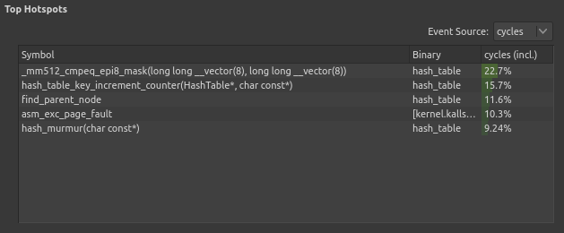

# Hash Table

## Introduction

Hash table is a data structure which allows for storage of arbitrary sets of
keys. Well-implemented hash table ensures fast access and insertion times.

This research focused on optimizing the performance of a program, which heavily
relied on the efficient hash table implementation.

## Materials and methods

### **Hash table algorithm**

The tested data structure was implemented as follows (full implementation can
be found [here](https://github.com/MeerkatBoss/hash_table/blob/baseline/src/hash_table/hash_table.cpp)):

- Hash table used closed addressing (open hashing)
- Number of buckets in table was a prime number (19)
- Collisions were resolved using linked lists
- Hash table used [MurmurHash](https://github.com/aappleby/smhasher/blob/master/src/MurmurHash2.cpp)
    hash function

### **Program task**

The program performed the following actions:
1. Words were loaded from two text files
2. Hash value was calculated for each word using hash function
3. Words were added to hash tables (separate for two files) using the calculated
    hash values
4. Cosine similarity of two texts was calculated
5. Total number of distinct words exclusive to each text was calculated

Cosine similarity between texts was calculated using the formula:

$$ cos(\varphi) = \frac{\sum\limits_{w \in A} \left(f_A(w) \cdot f_B(w)\right)}
                        {\sqrt{\sum\limits_{w \in A} f_A^2(w)} \cdot
                         \sqrt{\sum\limits_{w \in B} f_B^2(w)}} $$
Where:
- $A$ - set of words in first text
- $B$ - set of words in second text
- $f_A(w)$ - frequency of word $w$ in first text
- $f_B(w)$ - frequency fo word $w$ in second text

Program compared the following two texts: [text A](assets/war_and_peace.txt) and
[text B](assets/pushkin_vol1-6.txt).

### **Testing methods**

Program performance was measured by executing it as a child process and
obtaining information on its performance using the `getrusage()` function.
The testing function implementation can be found
[here](tests/test_cases/benchmark.cpp).

Program was executed 10 times, the average and standard deviation were
calculated.

More detailed information about program performance (namely the most
performance-affecting functions and flame graph) was obtained using the
unix `perf` tool.

## Results

### **Baseline tests**

The results of first tests were as follows:

| Program version | Average time (ms) |
| --- | --- |
| baseline | 18300 $\pm$ 300 |

| |
| --- |
| *Figure 1. Baseline hotspot functions.* |

|  |
| --- |
| *Figure 2. Baseline flame graph* |

83% of program execution time is spent on calls to `strcmp` function, which
indicates that hash table is too small for the input set. Therefore, the
first optimization was to increase hash table size from 19 to 7019.

### **Second version tests**

The results of testing the [optimized version](https://github.com/MeerkatBoss/hash_table/tree/table_size_opt) were following:

| Program version | Average time (ms) | Absolute performance gain (times) |
| --- | --- | --- |
| baseline | 18300 $\pm$ 300 | 1 (baseline) |
| table size optimization | 129 $\pm$ 6 | 141 $\pm$ 9| 

| |
| --- |
| *Figure 3. Second version hotspot functions.* |

|  |
| --- |
| *Figure 4. Second version flame graph* |

Now only 45% of program execution time is spent on calls to `strcmp`, which
allows to perform optimizations of this function. 

### **Third version tests**

The second version of the program was optimized by replacing calls to `strcmp`
with calls to SIMD intrinsics. To use SIMD efficiently, the file format was
modified as follows:

- Each word must occupy exactly 64 consecutive bytes
- Shorter words must be padded with zeros on the left
- Start of each word must be 64-aligned
- Words longer than 64 bytes must not be present in file

The last requirement was easily satisfied, as neither Text A nor Text B
contained words longer than 64 bytes in UTF-8 encoding. The other requirements
were satisfied by converting the text using
[this Python script](https://github.com/MeerkatBoss/hash_table/blob/strcmp_intrin_opt/convert.py).

The test results for
[third version](https://github.com/MeerkatBoss/hash_table/tree/strcmp_intrin_opt)
were following:

| Program version | Average time (ms) | Absolute performance gain (times) | Relative performance gain (times) |
| --- | --- | --- | --- |
| baseline | 18300 $\pm$ 300 | 1 (baseline) | N/A |
| table size optimization | 129 $\pm$ 6 | 141 $\pm$ 9 | 141 $\pm$ 9| 
| SIMD optimization | 77 $\pm$ 9 | 240 $\pm$ 40 | 1.7 $\pm$ 0.3 |

| |
| --- |
| *Figure 5. Third version hotspot functions.* |

|  |
| --- |
| *Figure 6. Third version flame graph* |

### **Fourth and fifth version tests**

After optimizing `strcmp` the only remaining function to optimize is
`hash_murmur`. In the [fourth version](https://github.com/MeerkatBoss/hash_table/tree/hash_asm_opt)
this function was rewritten in pure assembly, and in the [fifth
](https://github.com/MeerkatBoss/hash_table/tree/inline_asm_opt) it was replaced
with inline assembly, to allow function inlining.

The test results for these versions are as follows:

| Program version | Average time (ms) | Absolute performance gain (times) | Relative performance gain (times) |
| --- | --- | --- | --- |
| baseline | 18300 $\pm$ 300 | 1 (baseline) | N/A |
| table size optimization | 129 $\pm$ 6 | 141 $\pm$ 9 | 141 $\pm$ 9| 
| SIMD optimization | 77 $\pm$ 9 | 240 $\pm$ 40 | 1.7 $\pm$ 0.3 |
| asm optimization | 71 $\pm$ 12 | 250 $\pm$ 50 | 1.1 $\pm$ 0.3 |
| inline asm optimization | 74 $\pm$ 11 | 250 $\pm$ 40 | 1.0 $\pm$ 0.3 |

| |
| --- |
| *Figure 7. Fourth version hotspot functions.* |

|  |
| --- |
| *Figure 8. Fourth version flame graph* |

| |
| --- |
| *Figure 9. Fifth version hotspot functions.* |

|  |
| --- |
| *Figure 10. Fifth version flame graph* |

## Discussion

### **The most effective optimizations**

Among all the optimization steps taken in this research, the first one had the
greatest effect on program performance. Hash table size of 19 was clearly
insufficient for the volumes of text loaded into it. Increasing the hash size
made it possible to apply other optimizations.

Usage of SIMD required changing the input format, but it nearly doubled the
program performance.

### **The less efficient optimizations**

Both assembly-based optimizations did not provide a significant performance gain.
This indicates, that the MurmurHash algorithm is already an efficient
algorithm and cannot be optimized any more.

## Conclusions

When optimizing the performance of hash table, the most important step is to
choose the appropriate hash table size. Another logical step would be to allow
the hash table to resize itself automatically in order to maintain small
bucket sizes.

Usage of SIMD restricts the format of input data and makes program non-portable,
but provides a significant performance gain and can be used in cases, where
requirements for input format can be easily satisfied and program portability
is not required.

Assembly-based optimizations can only be applied in specific cases, where
the algorithm cannot be implemented efficiently in plain C. This is not the
case for MurmurHash, which was already implemented efficiently by its authors.
