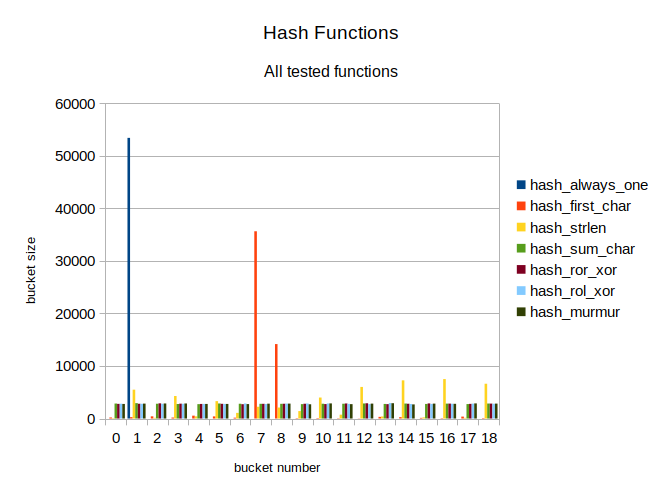

# Hash function comparison

## Introduction
One of the main aspects of hash table performance is the choice of the hash
function. A good hash function should not favour one value over another,
producing a uniform distribution of hash values, which ensures faster table
access times.

In this research several hashing algorithms were compared in order to select
the best one.

## Materials and methods

### **Hash table algorithm**
Tested hash functions were used in a hash table data structure. Hash table
was implemented [here](../src/hash_table/hash_table.cpp) as follows:
- Hash table used closed addressing (open hashing)
- Number of buckets in table was a prime number (values 19 and 7019 were chosen)
- Collisions were resolved using linked lists

### **Hash functions**
The following functions were tested (for implementations, see
[this file](../src/hash_table/hashes/hash_functions.cpp)):

- `hash_always_one` - Returns 1 for every input
- `hash_first_char` - Returns the value of the first byte in word
- `hash_strlen`     - Returns the length (in bytes) of the word
- `hash_sum_char`   - Returns the sum of bytes representing a word
- `hash_ror_xor`    - Accumulates hash using formula:
                      `hash = (hash ror 1) xor byte`
- `hash_rol_xor`    - Accumulates hash using formula:
                      `hash = (hash rol 1) xor byte`
- `hash_murmur`     - Implementation of [MurmurHash by Austin Appleby
  ](https://github.com/aappleby/smhasher/blob/master/src/MurmurHash2.cpp)

### **Testing method**
The testing sequence were as follows:
1. Words were loaded from a text file
2. Hash value was calculated for each word using tested function
3. Words were added to hash table using the calculated hash values
4. Bucket sizes in hash table were determined
5. Information about bucket sizes was dumped into a `.csv` file

### **Loaded data**
The data stored in hash table was read from a famous Russian novel "War and
Peace" by Lev Tolstoy. Before loading the file, it was stripped of any
punctuation and converted to lowercase using [this Python script
](../convert.py).

## Results

### **All tested functions**
The information about bucket sizes for all tested functions in hash table
of size 19 is shown in *Figure 1*.
|  |
|:---|
| *Figure 1. Hash functions summary* |

### **Functions with smaller buckets**
The information about bucket sizes produced by selected functions (namely,
`hash_sum_char`, `hash_ror_xor`, `hash_rol_xor` and `hash_murmur`) is shown in
*Figure 2*.

|  |
|:---|
| *Figure 2. Selected functions summary* |

### **Other hashing functions**
*Figure 3* shows the distributions of values produced by functions
`hash_always_one`, `hash_first_char` and `hash_strlen`.

|  |
|:---|
| *Figure 3. Larger bucket sizes* |

### **Larger hash tables**

The distribution of values for `hash_strlen` function seems puzzling, due to the
fact that its normal distribution plot seem to be wrapped by `mod 19` operation.
Additionally, the Central Limit Theorem predicts that the values produced by
`hash_sum_char` have to be distributed normally and we expect to see one or
several high peaks in its values' distribution, which is apparently not the
case.  Therefore, these functions were tested on a larger bucket count of 7019
to better see their distributions. The results of these tests are shown in
*Figure 4* and *Figure 5*.

|  |  |
|:---|:---|
| *Figure 4. Full distribution for `hash_strlen`* | *Figure 5. Full distribution for `hash_sum_char`* |

The test with bucket count of 7019 was also performed for functions
`hash_ror_xor`, `hash_rol_xor` and `hash_murmur`. The results are presented
in *Figure 6*.

|  |
|:---|
| *Figure 6. Near-uniform distributions* |

## Discussion

### **Best hash functions**
The functions `hash_sum_char`, `hash_ror_xor`, `hash_rol_xor` and `hash_murmur`
performed very similarly on a smaller hash tables. Their distributions are close
to uniform, which is ideal for the hash function.

However, increasing the bucket count revealed that `hash_sum_char` suffers
(rather predictably) from the effects of the Central Limit Theorem, which causes
it to favour some of the hash values over the others and to leave most buckets
in a table nearly empty.

On the other hand, the distributions of `hash_ror_xor`, `hash_rol_xor` and
`hash_murmur` remain near-uniform even when increasing the table size. The
`hash_murmur` function produces slightly smaller bucket sizes: in test with
bucket count of 7019 the sizes of buckets produced by `hash_murmur` did not
exceed 15.

### **Distribution of `hash_strlen`**

The distribution of `hash_strlen` values on large bucket count appears to be
a blend of two normal distributions: one with the mean of 7 and another with a
mean of 16. Additionally, the second distribution affects the even-numbered
buckets exclusively, while the first one does not have this property. There
seems to be very few elements in buckets with odd numbers greater than 20.

These properties suggest that the smaller distribution was produced by French
words in Tolstoy's text, which are mostly composed of latin letters.  These
letters are represented with a single byte in UTF-8 encoding, therefore the
length of a word is close to the value returned by `strlen` function. The
Russian words, on the other hand, are composed of cyrillic letters, represented
with two bytes in UTF-8. Therefore, for these words `strlen` returns the value
equal to twice the number of letters in the word, which explains the lack of
long words with odd length.

## Conclusions
The most effective hashing functions in this research are `hash_ror_xor`,
`hash_rol_xor` and `hash_custom`. All of these functions have almost identical
value distributions close to uniform one, which makes them all the perfect
choice for usage in hash table implementations and allows them to be used
interchangeably.
