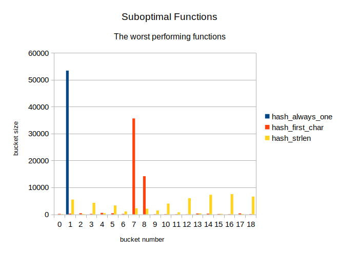

# Hash function comparison

## Introduction
One of the defining aspects of hash table performance is the choice of the
hash function. A good hash function must not favour one value over another,
producing a uniform distribution of hash values, which ensures faster table
access times.

In this research several hashing algorithms were compared in order to select
the best one.

## Materials and methods

### **Hash table algorithm**
The tested hash functions were used in a hash table data structure. The
implemented hash table used closed addressing (open hashing) with
linked list collision resolution.

### **Hash functions**
The following functions were tested (for implementation, see
[this file](../src/hash_table/hashes/hash_functions.cpp)):

- `hash_always_one` - Returns 1 for every input
- `hash_first_char` - Returns the value of the first byte in word
- `hash_strlen`     - Returns the length (in bytes) of the word
- `hash_sum_char`   - Returns the sum of bytes representing a word
- `hash_ror_xor`    - Accumulates the hash by rotating the accumulator
                      cyclically by one bit to the right and then performing
                      bitwise `xor` with next byte of a word
- `hash_rol_xor`    - Accumulates the hash by rotating the accumulator
                      cyclically by one bit to the left and then performing
                      bitwise `xor` with next byte of a word
- `hash_custom`     - Implementation of [MurmurHash by Austin Appleby
  ](https://github.com/aappleby/smhasher/blob/master/src/MurmurHash2.cpp)

### **Testing method**
In order to explore the hash values distribution of various hash functions the
text was loaded from file and each word from it was stored in  a hash table
using the tested function to determine the word hash. The information about
bucket sizes in a hash table was dumped into a `.csv` file.

### **Loaded data**
The data stored in hash table was read from a collection of works by 
Alexander Sergeyevich Pushkin, the famous Russian poet. The first 6 volumes of
[these 10](https://rvb.ru/pushkin/toc.htm) were taken. Before loading the file,
it was stripped of any punctuation and converted to lowercase using
[this Python script](../convert.py).

## Results

### **All tested functions**
When graphing the hash value distribution for all tested functions, the
following results were obtained:

### **Best performing functions**
Several functions on the previous histogram have high peaks which do not allow
us to see the differences between more optimal functions, so we will graph the
last ones separately:

### **Other hashing functions**
The worst-performing functions were also graphed separately:

The distribution of values for `hash_strlen` function seems puzzling, due to the
fact that its normal distribution graph seem to be wrapped by `mod 19` operation.
Additionally, the Central Limit Theorem predicts that the values produced by
`hash_sum_char` have to be distributed normally and we must see one or several
high peaks in its values' distribution, which is apparently not the case.
Therefore, these functions were tested on a larger bucket count of 919 to better
see their distributions. The results of these tests are following:

## Discussion

### **Best hash functions**
The functions `hash_sum_char`, `hash_ror_xor`, `hash_rol_xor` and `hash_custom`
performed very similarly on a smaller hash tables. Their distributions are close
to uniform, which is ideal for the hash function. However, increasing the bucket
count revealed that `hash_sum_char` suffers (rather predictably) from the
effects of the Central Limit Theorem, which causes it to favour some of the hash
values over the others. 

### **Distribution of `hash_strlen`**

The distribution of `hash_strlen` values on large bucket count appears to be
a blend of two normal distributions: one with the mean of 7 and another with a
mean of 16. Additionally, the second distribution affects the even-numbered
buckets exclusively, while the first one does not have this property. There
seems to be very few elements in buckets with odd numbers greater than 20.

These properties suggest that the smaller distribution was produced by French
words in Pushkin's text, which are mostly composed of latin letters.  These
letters are represented with a single byte in UTF-8 encoding, therefore the
length of a word is close to the value returned by `strlen` function. The
Russian words, on the other hand, are composed of cyrillic letters, represented
with two bytes in UTF-8. Therefore, for these words `strlen` returns the value
equal to twice the number of letters in the word, which explains the lack of
long words with odd length.

## Conclusions
The most effective hashing functions in this research are `hash_ror_xor`,
`hash_rol_xor` and `hash_simple`. All of these functions have almost identical
value distributions close to uniform one, which makes them all the perfect
choice for usage in hash table implementations and allows them to be used
interchangeably.
